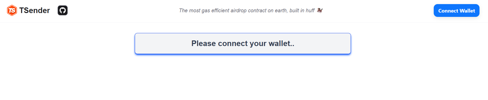
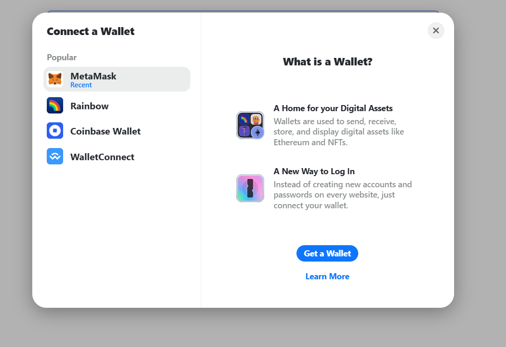
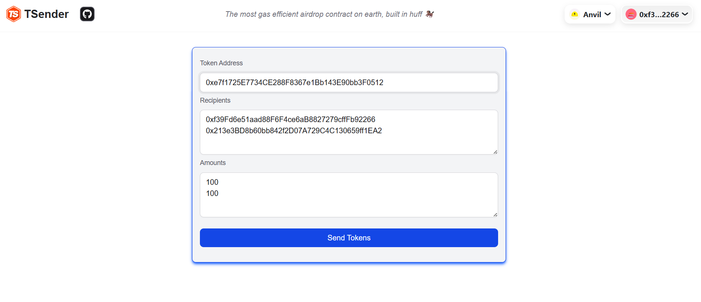

 <h1 align="center"> 💸 TSender - Token Sender Web App 💸</h1>

**TSender** is a decentralized web application that allows users to **connect their wallet** and **send ERC-20 tokens** to **multiple recipients at once**. It's a convenient tool for airdrops, giveaways, and mass transfers built on Ethereum-compatible networks.

---

## 🚀 Features

- 🔗 Connect wallet with **RainbowKit**
- 📤 Send tokens to **multiple addresses at once**
- 💼 Supports any **ERC-20 compatible** tokens
- 🧠 Smart contract read/write powered by **Wagmi**
- ⚡ Fast, user-friendly, and gas-optimized

---

## 🛠️ Tech Stack

- **Next.js** – React-based web framework  
- **TypeScript** – For static typing  
- **Tailwind CSS** – For fast and responsive UI  
- **RainbowKit** – Wallet connection  
- **Wagmi** – Ethereum hooks and contract interactions    
- **Smart Contract** – Written in Solidity

---

## 📸 Screenshots

        

        

        

